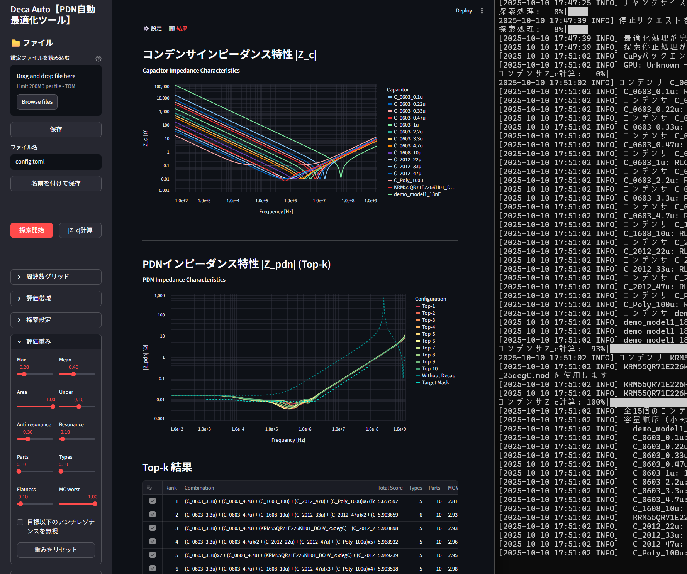
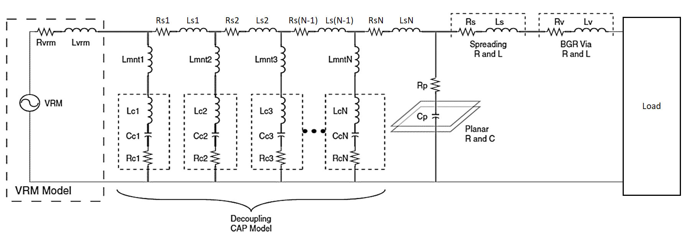
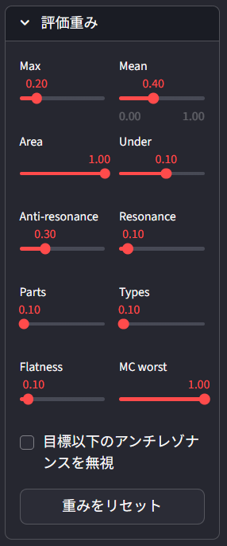

# GUI版 デカ・オート (Deca-Auto)

**Deca-Auto: Automated Optimization of Decoupling Capacitor Combinations in PDN**

デカップリングコンデンサの組み合わせ最適解を自動探索するツールです。
定義されたコンデンサの中から、アンチレゾナンスの少ない優れた合成インピーダンスを持つ組み合わせを自動で探索します。
旧CLI版(https://github.com/YAEemf/deca_auto.git) より大幅に機能と探索速度および評価精度が向上しています。


---

## 概要
- デカップリングコンデンサの組み合わせ自動探索
- MurataやTDK提供の`SPICE`モデルを利用可能（.modファイル）
- コンデンサの基本パラメータ（C / ESR / ESL）を自分で定義して利用可能
- 想定PDN



## 使い方

### 1. 実行方法
#### インストール
```bash
python -m pip install -e .
```
#### 通常起動
```bash
python -m deca_auto
```
#### CLI（tomlを渡さないとconfig.pyのデフォルト値で探索します）
```bash
python -m deca_auto --no-gui --config config.toml
```
[option]
--no-search       探索を行わずZ_cのみ計算
--force-numpy     GPUを使わずCPUのみで探索
--cuda [識別番号]   使用するCUDAデバイスを指定
--verbose         詳細なログ出力
--output          サマリExcelの出力ディレクトリ

### 2. 設定方法
以下のいずれかでコンデンサを定義します：

- **SPICEモデルを利用する** 
  `.mod` ファイルのパス（modelディレクトリ内のモデル拡張子は省略可）をGUIのリストまたは `.tomlファイル` に定義
  
- **LCRパラメータを直接定義する**  
  各コンデンサの C / ESR / ESL などのパラメータをGUIのリストまたは`.tomlファイル` に定義。ESR、ESLを省略した場合はデフォルト値（10mΩ、0.5nH）が適用されます。

※組み合わせにおけるコンデンサの個数上限に加えて、各コンデンサの使用個数範囲も「使用数範囲」欄で指定できます。

入力例：

3（そのコンデンサを3個必ず使う）

-5（そのコンデンサを最大5個使う）

2-（そのコンデンサを2個以上使う）


### 3. 探索設定
どのようなインピーダンス特性を持つ組み合わせを探索するのか「目標マスク」と「評価重み」で設定できます。各評価項目を個別に算出し、それぞれに対応する`重み`を乗算した数値の総和を`スコア`として扱います。Deca-Autoではより小さい`スコア`を求めて探索します。つまり、重みを増やすとその評価項目に対する影響が大きくなり、自然とその特性に対して優れた組み合わせが最終的に残ります。


- Max：インピーダンスの最大値
- Mean：インピーダンスの平均値
- Area：目標マスクを超過した面積
- Under：目標マスクを下回った面積
- Anti-resonance：反共振（ピーク数とその高さで評価）
- Resonance：共振（急峻な谷を検知）
- Parts：総部品数
- Types：組み合わせにおけるコンデンサの種類
- Flatness：平滑さ
- MC worst：部品特性のばらつき

---

## 👤 Author
- YAE

## 📄 License
- MIT (お好きに役立ててください)
---