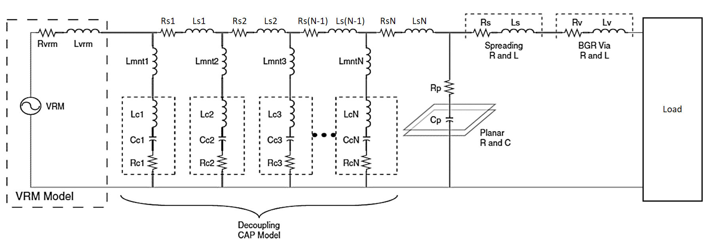

# GUI版 デカ・オート (Deca-Auto)

**Deca-Auto: Automated Optimization of Decoupling Capacitor Combinations in PDN**

デカップリングコンデンサの組み合わせ最適解を自動探索するツールです。
定義されたコンデンサの中から、アンチレゾナンスの少ない優れた合成インピーダンスを持つ組み合わせを自動で探索します。
旧CLI版(https://github.com/YAEemf/deca_auto.git) より大幅に機能と探索速度および評価精度が向上しています。


---

## 概要
- デカップリングコンデンサの自動探索
- MurataやTDK提供の`SPICE`モデルを利用可能（.modファイル）
- コンデンサの基本パラメータ（C / ESR / ESL）を自分で定義して利用可能
- 想定PDN


---

## 👤 Author
- YAE

## 📄 License
- MIT (お好きに役立ててください)

---

## 使い方

### 1. 実行方法
#### 通常起動
```bash
python -m deca_auto
```
#### CLI（tomlを渡さないとconfig.pyのデフォルト値で探索します）
```bash
python -m deca_auto --config config.toml
```

### 2. 設定方法
以下のいずれかでコンデンサを定義します：

- **SPICEモデルを利用する場合** 
  `.mod` ファイルのパスをGUIのリストまたは `.tomlファイル` に定義
  
- **パラメータを直接定義する場合**  
  各コンデンサの C / ESR / ESL などのパラメータをGUIのリストまたは`.tomlファイル` に定義
---